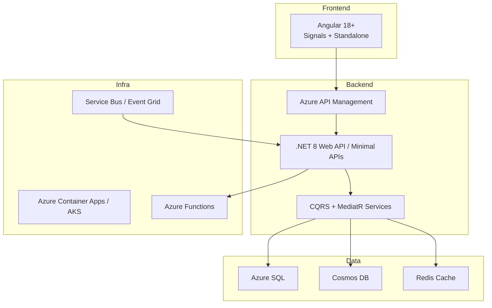

# Interview Analysis: Jury Management System Position

**Extracted Questions, Candidate Answers, Evaluation, and Improved Responses**

## 1. Behavioral Questions

### Q: Why did you leave your last role?
**Candidate Answer:** Laid off from Wells Fargo due to company-wide reductions.

**Evaluation:** Honest, but frame more positively.

**Improved Answer:**
> I was impacted by a large-scale reduction in force at Wells Fargo. I'm excited to bring my full-stack .NET and Angular experience to a meaningful project like the Jury Management System in the public sector.

---

### Q: Where do you see yourself in 5 years?
**Candidate Answer:** Continue as a developer on interesting and useful projects.

**Evaluation:** Vague. Add ambition and alignment.

**Improved Answer:**
> In five years, I see myself as a Senior Full-Stack Developer or Technical Lead, specializing in cloud-native applications on Azure, contributing to scalable public service systems while mentoring others.

---

### Q: Tell me about a time you disagreed with your manager.
**Candidate Answer:** Disagreed privately via email/1:1, offered alternatives focused on client expectations.

**Evaluation:** Good professional example.

**Improved Answer:**
> In a project, my manager planned to deliver a feature in six months, but the client needed it sooner. I listened in the meeting, then followed up privately with timeline analysis and two options: a hotfix or managing expectations. We chose clear communication, avoiding misalignment.

---

### Q: How do you stay current with technology?
**Candidate Answer:** Official docs (angular.io), personal GitHub experiments, examples.

**Evaluation:** Practical and good.

**Improved Answer:**
> I allocate weekly learning time. I follow official documentation, build PoCs, experiment on GitHub (e.g., TypeScript utilities), and use AI tools to explore new patterns quickly.

---

### Q: Preferred development methodologies?
**Candidate Answer:** Prefers well-documented Waterfall but sees value in Agile ceremonies.

**Evaluation:** Honest, but emphasize flexibility.

**Improved Answer:**
> I thrive with hybrid approaches — strong documentation combined with Agile/Scrum ceremonies for adaptability and alignment.

---

### Q: How do you ensure code quality?
**Candidate Answer:** CI/CD gates (ADO, SonarQube), tests, static analysis.

**Evaluation:** Solid.

**Improved Answer:**
> Automated CI/CD pipelines with SonarQube, comprehensive unit/integration tests, linting (ESLint/StyleCop), and peer code reviews.

---

## 2. Technical & Architectural Questions

### Last Project Tech Stack
**Candidate:** Angular + .NET API + SQL + Cosmos DB (Mongo) on Azure. Stronger in .NET (7-8/10), Angular (5-6/10).

### Q: Modernizing a Monolithic Legacy Application

**Candidate Approach:** Break into UI (Angular) + REST APIs (.NET) + DB. Move logic from stored procedures to services. Use Entity Framework.

**Evaluation:** Reasonable, but can be more modern/cloud-native.

**Recommended Modern Architecture (for Jury Management System):**



**Key Principles:**
- Microservices where it makes sense (Juror, Scheduling, Payments)
- Vertical Slice Architecture
- Event-driven notifications
- Heavy use of Azure-native services

**Code Example (.NET 8 Minimal API):**
```csharp
app.MapGet("/jurors", async (IJurorService service, CancellationToken ct) =>
    Results.Ok(await service.GetJurorsAsync(ct)))
    .RequireAuthorization();
```

**Code Example (Angular Route Guard for Admin):**
```typescript
@Injectable({ providedIn: 'root' })
export class AdminGuard implements CanActivate {
  canActivate(): boolean {
    return this.authService.isAdmin() 
      ? true 
      : (this.router.navigate(['/unauthorized']), false);
  }
}
```

### Q: Authentication & Authorization
**Improved Answer:** Use Azure Entra ID / ASP.NET Core Identity + JWT. Angular route guards + HTTP interceptors.

### Q: Logging & Observability
**Improved Answer:** Serilog + Azure Application Insights + Azure Monitor (replaces old ELMA).

### Q: Handling 10x Traffic Increase
**Improved Answer:**
1. Auto-scale Azure resources
2. Implement caching (Redis)
3. Database optimization + read replicas
4. Pagination + async processing via Service Bus

### Q: Using AI Tools (Copilot, Claude, etc.)
**Improved Answer:**
> I use GitHub Copilot daily for acceleration but always review, test, and refactor output to match our style guide and performance standards. Goal: Human-owned, clean, maintainable code.

---

## Overall Feedback for Candidate

**Strengths:**
- Practical full-stack experience
- Real cloud migration background
- Honest self-assessment
- Good communication

**Areas to Strengthen:**
- Use more current terminology (.NET 8, Angular Signals, CQRS, Vertical Slices)
- Show stronger enthusiasm for Angular/UI
- Prepare specific Azure service examples

---

*Document generated from interview transcript analysis.*